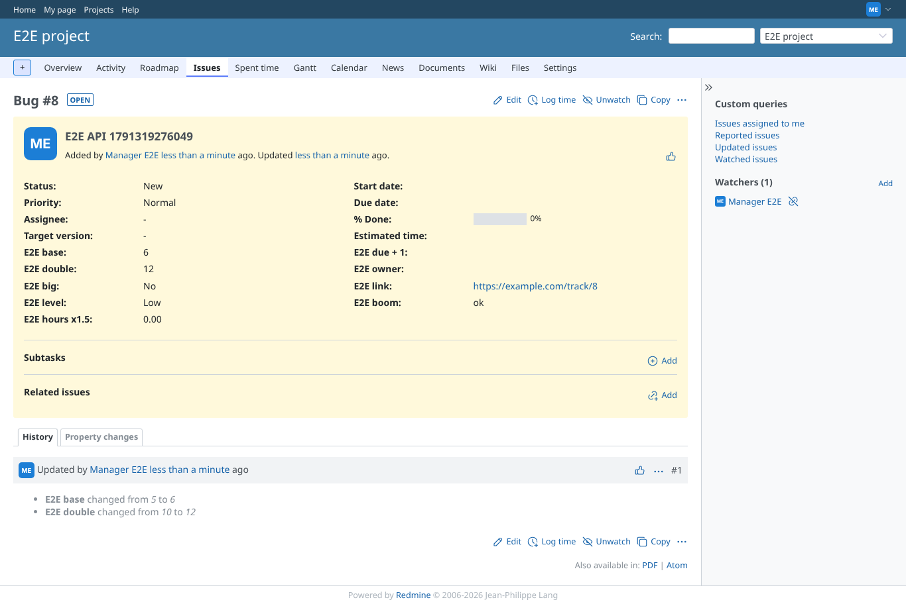
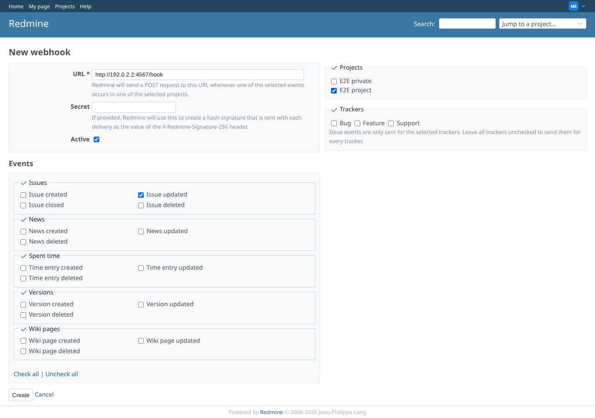
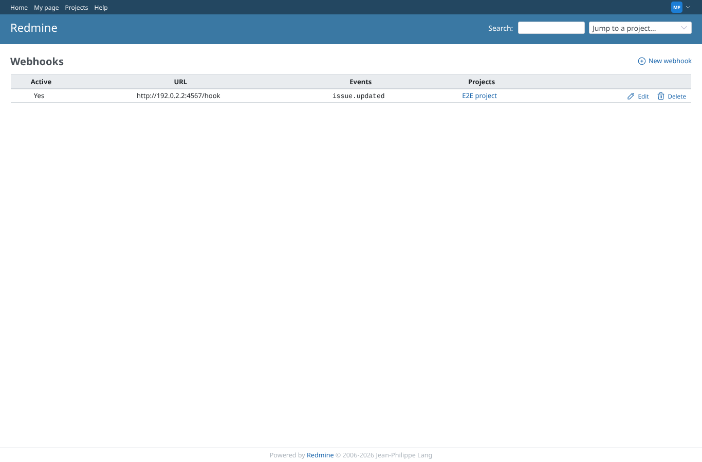
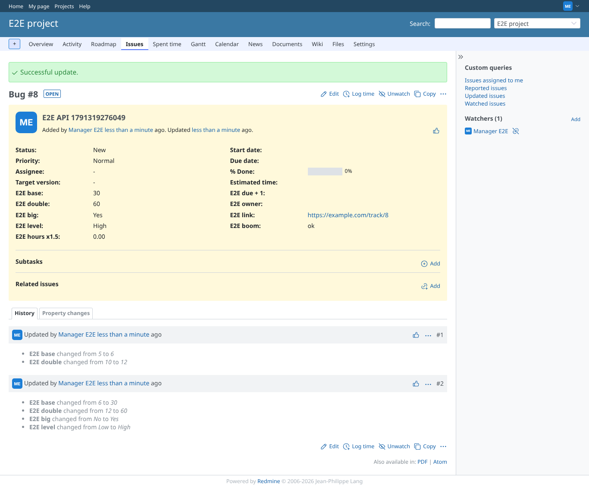

# api_and_webhook

Run 2026-10-06T20:41:22.216Z against http://127.0.0.1:3000.

| screenshot | user | URL | shows |
|---|---|---|---|
|  | manager | `/issues/8` | Issue created and updated through the API with a forged "E2E double": the formula wins (5 -> 10, 6 -> 12) |
|  | manager | `/webhooks/new` | The manager creates a webhook to http://192.0.2.2:4567/hook for issue updates in E2E project |
|  | manager | `/webhooks` | The webhook is created and active |
|  | manager | `/issues/8` | After E2E base 6 -> 30 the webhook payload carries E2E double = 60, the stored computed value |
