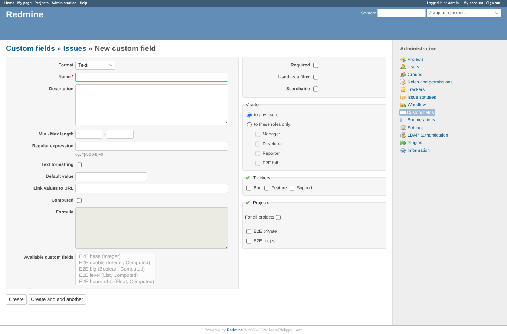
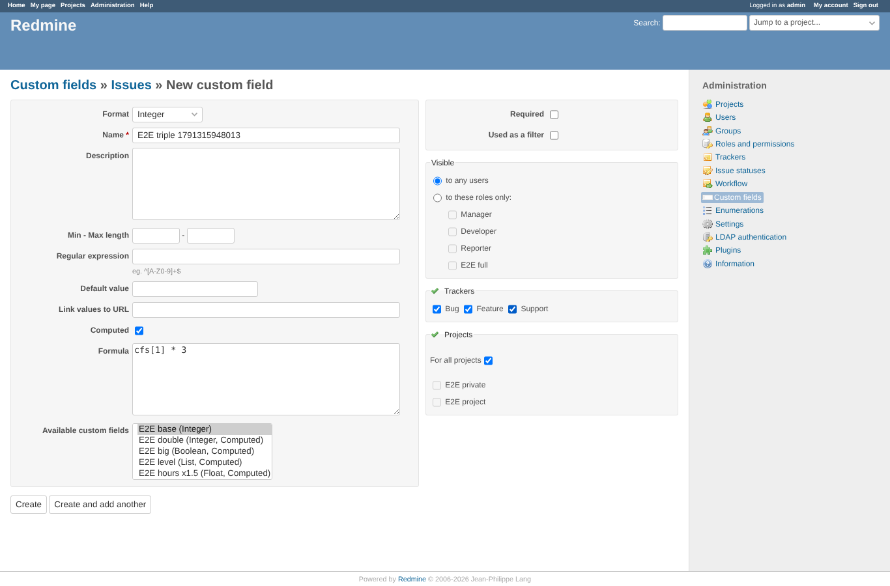
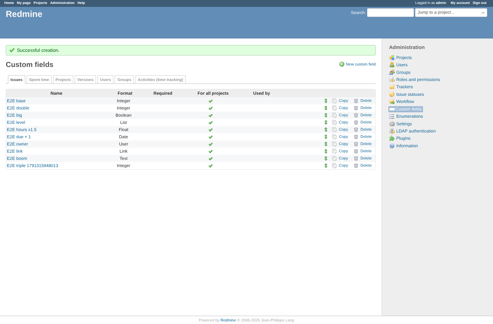
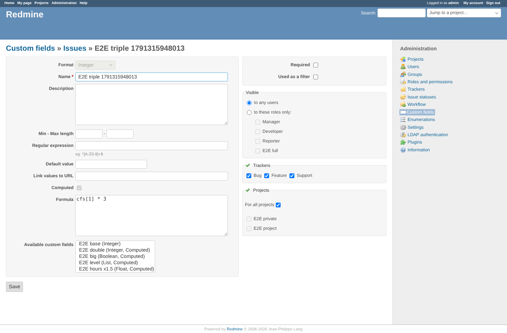
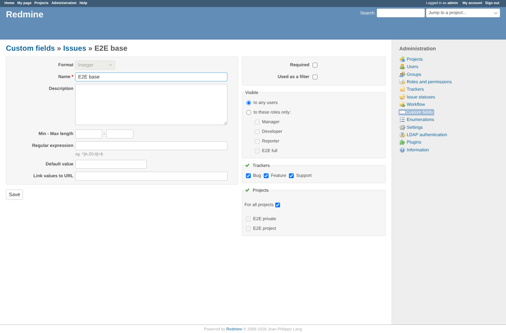
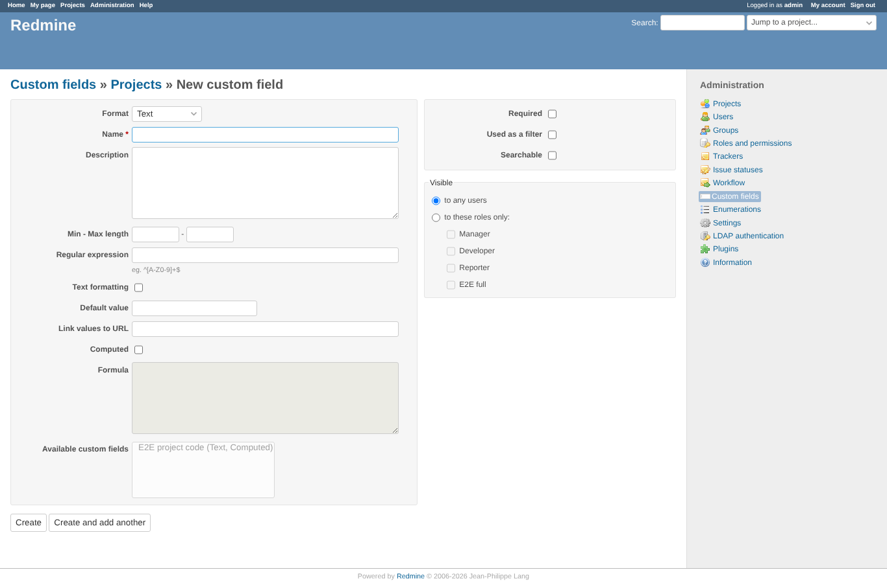
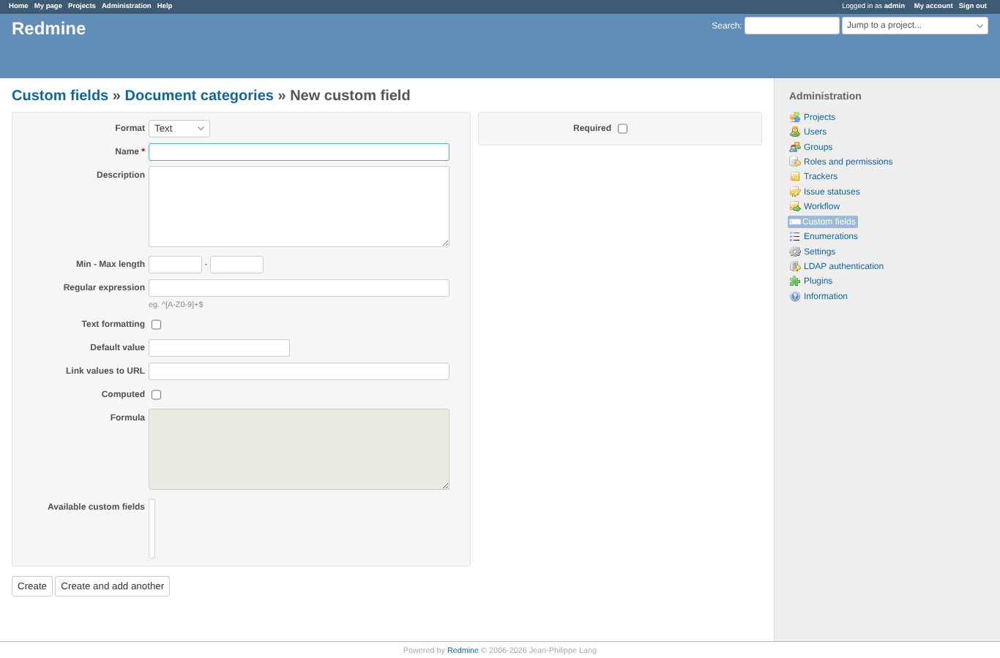
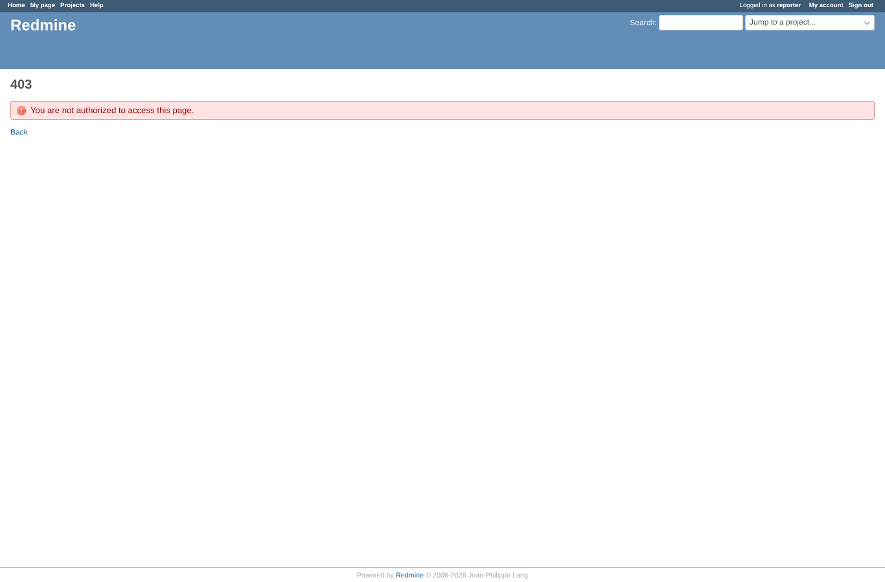

# formula_form

Run 2026-10-06T19:45:57.561Z against http://127.0.0.1:3000.

| screenshot | user | URL | shows |
|---|---|---|---|
|  | admin | `/custom_fields/new?type=IssueCustomField` | New issue custom field: "Computed" unticked, formula and available fields disabled |
|  | admin | `/custom_fields/new?type=IssueCustomField` | Integer, "Computed" ticked, a double-click on "E2E base" inserted cfs[1], " * 3" typed |
|  | admin | `/custom_fields?tab=IssueCustomField` | The computed field is created and listed |
|  | admin | `/custom_fields/16/edit` | Edit: "Computed" is ticked and locked, the formula is kept, the field does not list itself |
|  | admin | `/custom_fields/16/edit` | After a crafted request with "Computed" off the field is still computed |
|  | admin | `/custom_fields/1/edit` | Edit of a saved plain field: no computed section (cannot become computed) |
|  | admin | `/custom_fields/new?type=ProjectCustomField` | New project custom field: only project fields are offered |
|  | admin | `/custom_fields/new?type=DocumentCategoryCustomField` | Empty state: no other document category field, the list is empty |
|  | manager | `/custom_fields/new?type=IssueCustomField` | manager: the custom field form (and so formulas) is refused, admin only |
|  | reporter | `/custom_fields/new?type=IssueCustomField` | reporter: the custom field form (and so formulas) is refused, admin only |
