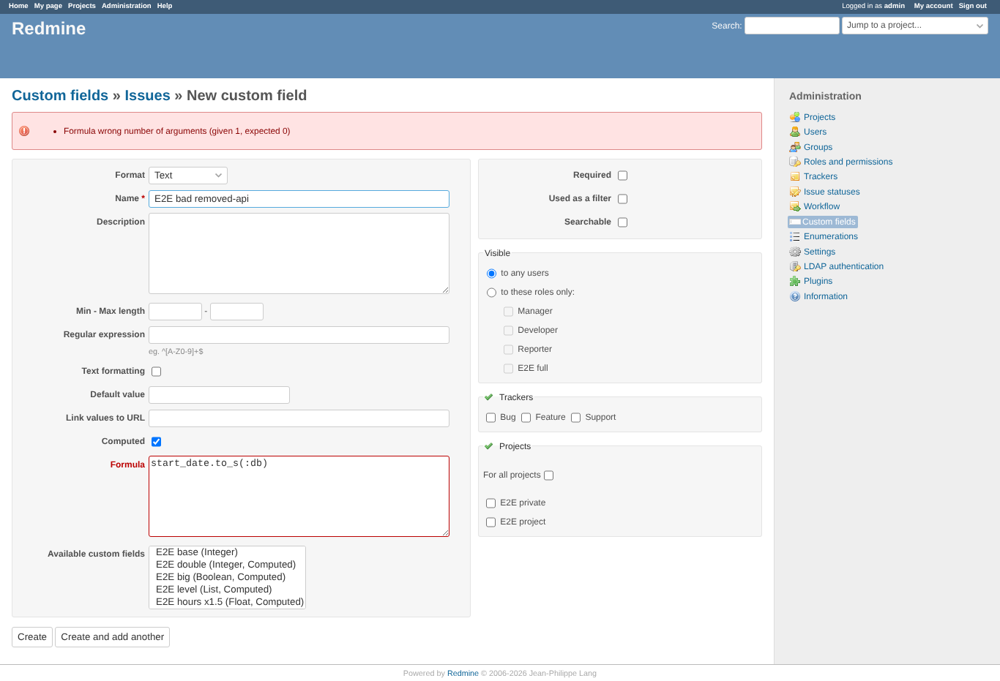
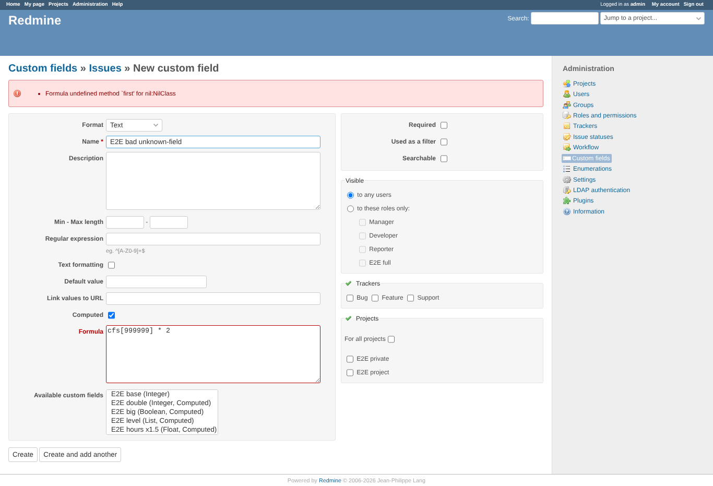
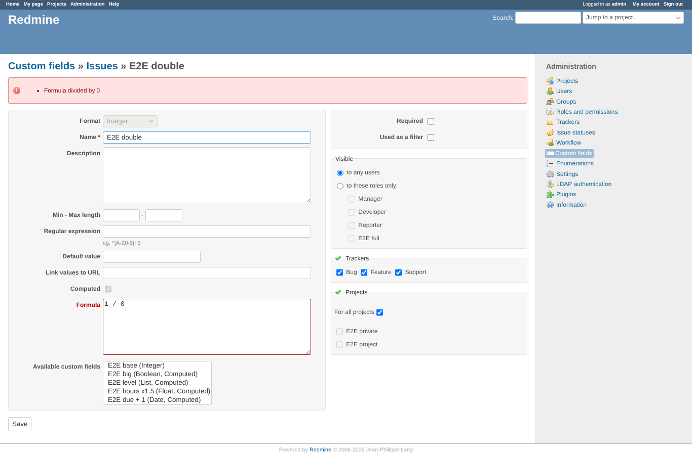
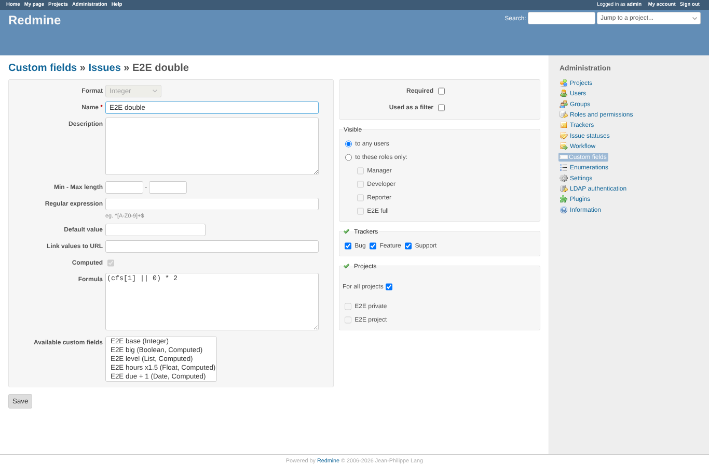

# formula_validation

Run 2026-10-06T19:45:45.576Z against http://127.0.0.1:3000.

| screenshot | user | URL | shows |
|---|---|---|---|
|  | admin | `/custom_fields` | Create with formula "1 / 0" is refused: Formula divided by 0 |
|  | admin | `/custom_fields` | Create with formula "cfs[1] +" is refused: Formula (eval):1: syntax error, unexpected end-of-input cfs[1] + ^ |
|  | admin | `/custom_fields` | Create with formula "start_date.to_s(:db)" is refused: Formula wrong number of arguments (given 1, expected 0) |
|  | admin | `/custom_fields` | Create with formula "cfs[999999] * 2" is refused: Formula undefined method `first' for nil:NilClass |
|  | admin | `/custom_fields/2` | Changing the formula of "E2E double" to 1 / 0 is refused with the reason |
|  | admin | `/custom_fields/2/edit` | The stored formula is unchanged: (cfs[1] || 0) * 2 |
