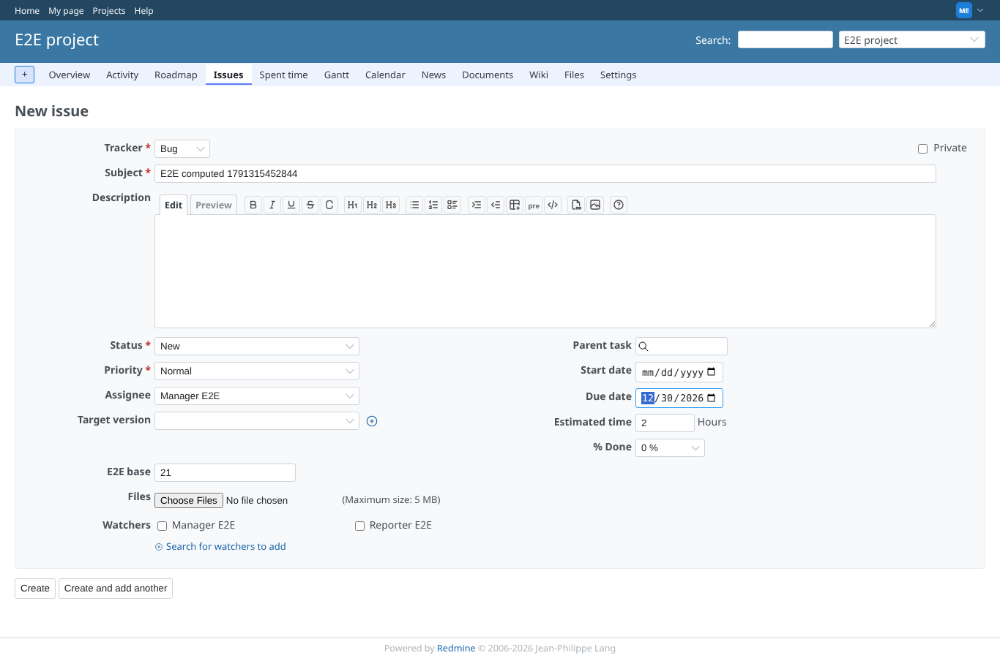
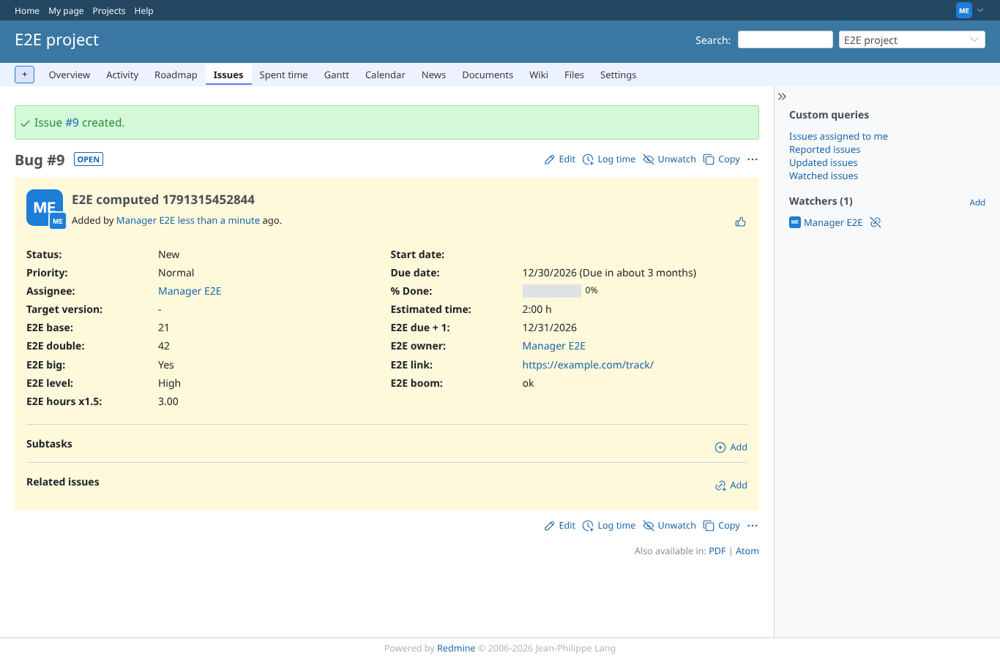
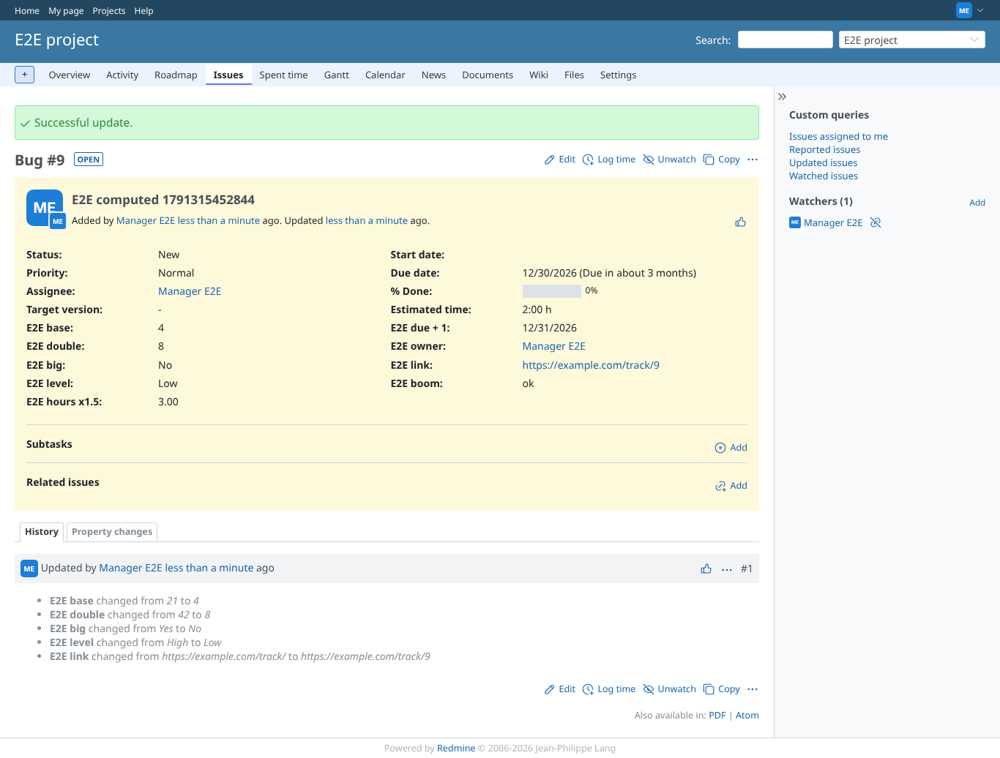
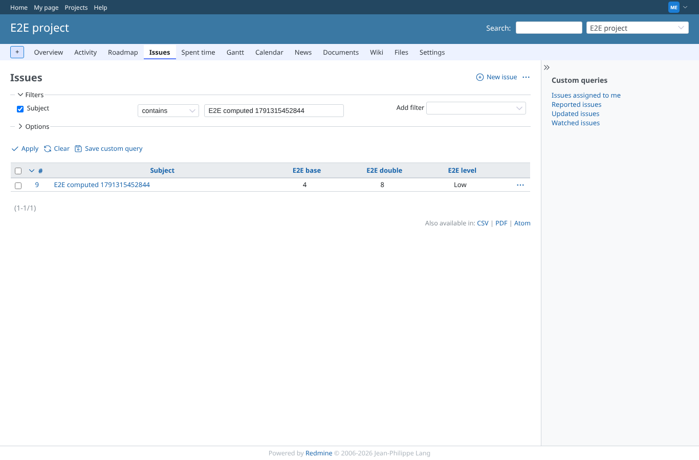
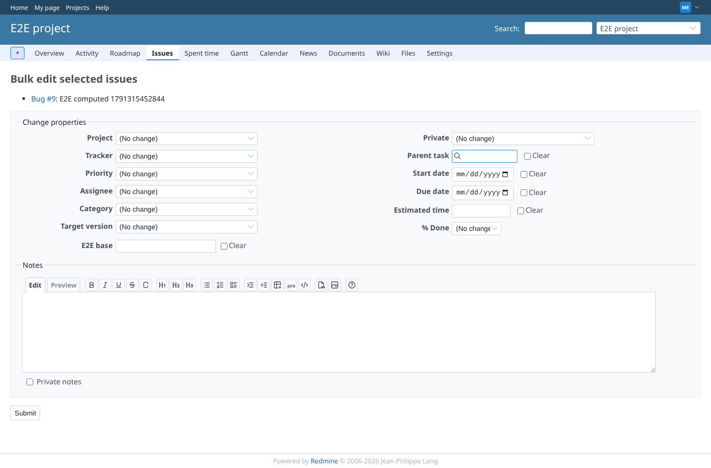
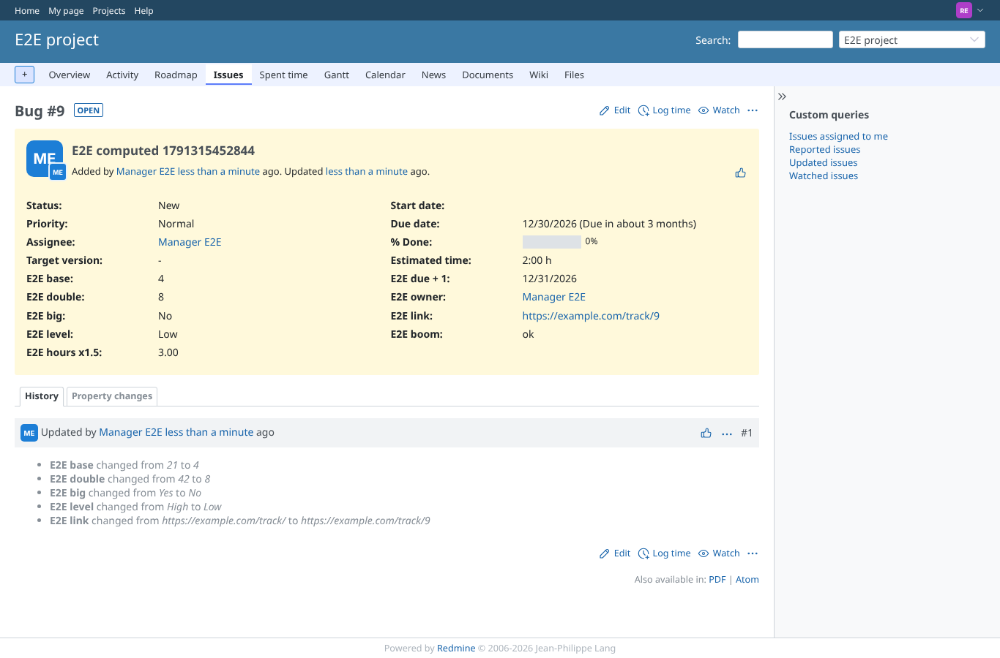
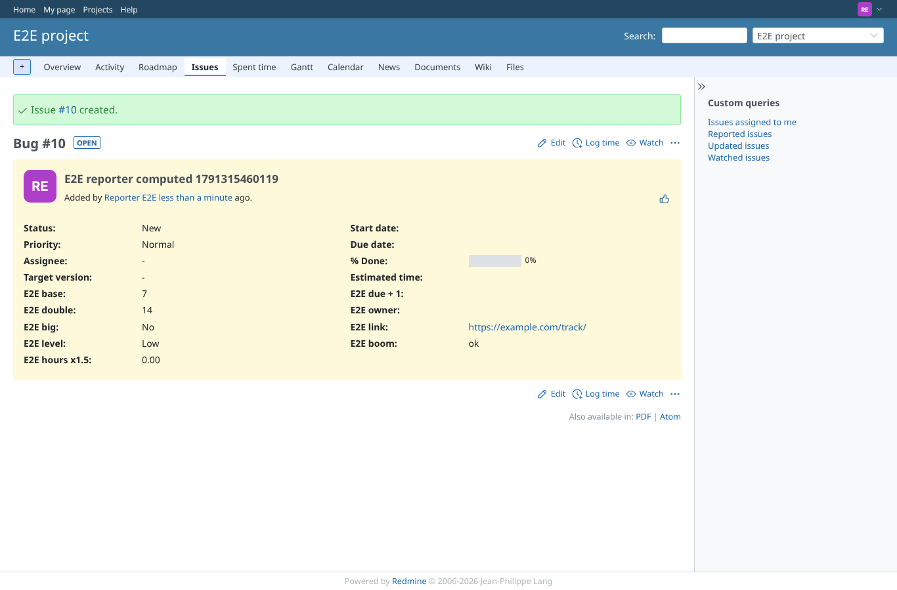

# issue_computation

Run 2026-10-06T19:37:42.814Z against http://127.0.0.1:3000.

| screenshot | user | URL | shows |
|---|---|---|---|
|  | manager | `/projects/e2e-project/issues/new` | New issue form: only "E2E base" is an input, the computed fields are read-only and not shown |
|  | manager | `/issues/9` | Created with E2E base 21, 2 h, due 2026-12-30, assignee Manager: double 42, big Yes, level High, hours 3.00, due+1 12/31/2026, owner, boom ok; the link has no id yet: before_validation runs before the insert (same on 5.1) |
|  | manager | `/issues/9` | After E2E base 21 -> 4: double 8, big No, level Low, link now with the id; the change of the computed fields is in the history |
|  | manager | `/projects/e2e-project/issues?set_filter=1&f[]=subject&op[subject]=~&v[subject][]=E2E%20computed%201791315452844&c[]=subject&c[]=cf_1&c[]=cf_2&c[]=cf_4` | Issue list with E2E base, E2E double and E2E level as columns |
|  | manager | `/issues/bulk_edit?ids[]=9` | Bulk edit offers E2E base but no computed field |
|  | reporter | `/issues/9` | A member without extra permissions (Reporter) sees the computed values |
|  | reporter | `/issues/10` | A Reporter creates an issue with E2E base 7: E2E double 14 is computed for them too |
|  | outsider | `/projects/e2e-private/issues` | A non-member cannot reach the private project issues, computed values included |
