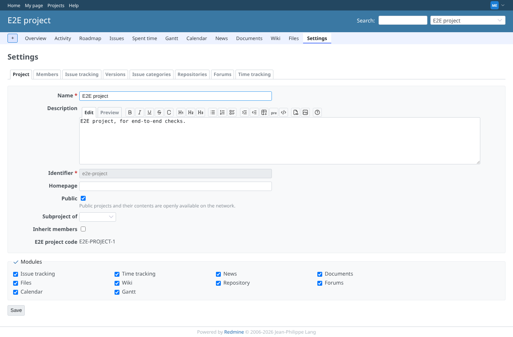
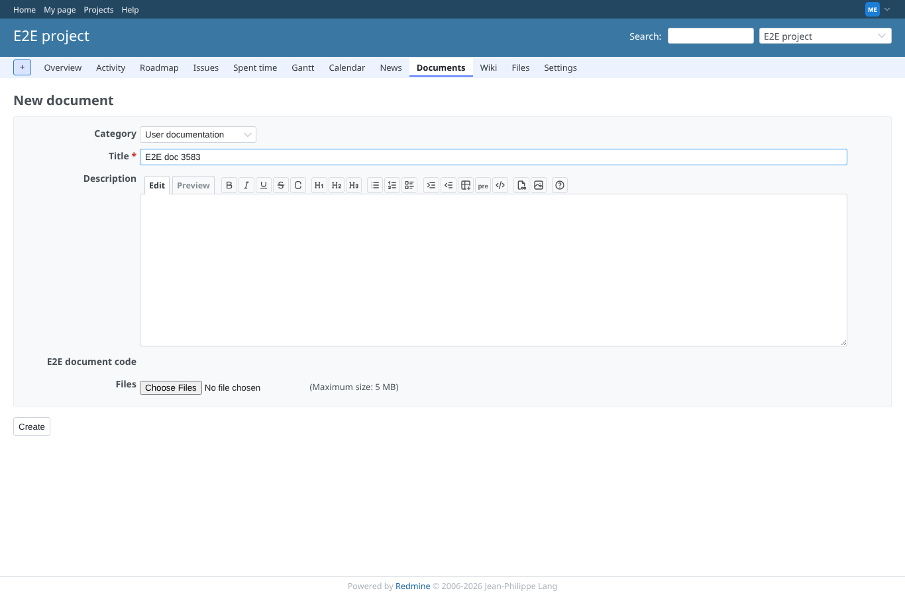
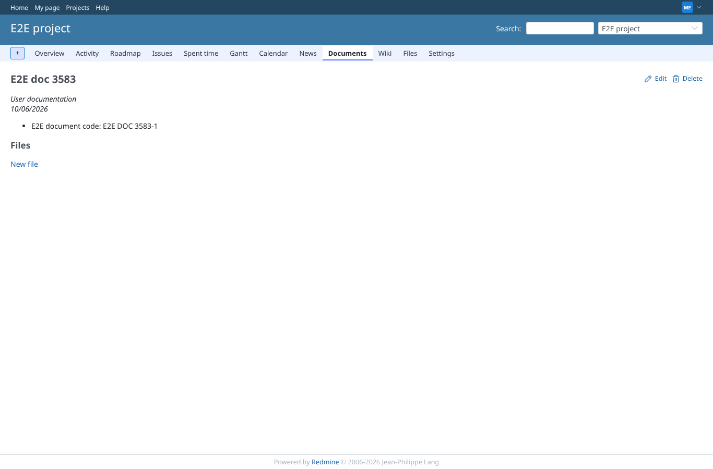

# other_models

Run 2026-10-06T20:58:25.180Z against http://127.0.0.1:3000.

| screenshot | user | URL | shows |
|---|---|---|---|
|  | manager | `/projects/e2e-project/settings` | Project settings as manager, after saving: "E2E project code" is shown as text (E2E-PROJECT-1), no input |
|  | manager | `/projects/e2e-project` | Project saved by the manager: "E2E project code" = E2E project code: E2E-PROJECT-1 |
|  | manager | `/projects/e2e-project/roadmap` | Version "E2E v86285" created by the manager: "E2E name length" = 10 |
|  | manager | `/projects/e2e-project/time_entries?set_filter=1&f[]=comments&op[comments]=~&v[comments][]=E2E+computed+minutes&c[]=spent_on&c[]=hours&c[]=comments&c[]=cf_12&sort=id:desc` | Time entry of 1.25 h logged by the manager and a forged 999 for "E2E minutes": the formula stores 75; the form shows the field as text |
|  | reporter | `/my/account` | My account as the reporter, after saving: "E2E display name" = "E2E, Reporter" shown as text, not as an input |
|  | admin | `/users/6` | User profile: "E2E display name" = "E2E, Reporter", computed when the reporter saved the account |
|  | admin | `/groups/8/edit` | Group saved by the admin: "E2E group slug" = e2e-group, shown as text in the form |
|  | admin | `/enumerations/8/edit` | Time entry activity "Design" saved by the admin: "E2E activity code" = DESIGN, shown as text in the form |
|  | manager | `/projects/e2e-project/documents/new` | New document as manager: "E2E document code" is shown as text, no input |
|  | manager | `/documents/1` | Document "E2E doc 3583" created by the manager: "E2E document code" = E2E DOC 3583-1, the id included on creation |
