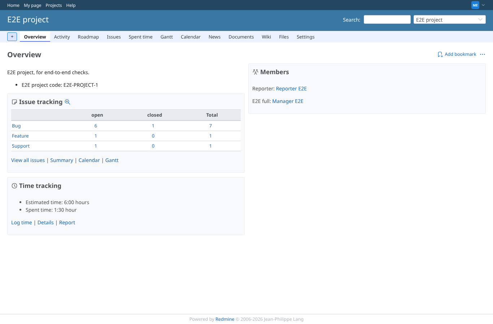
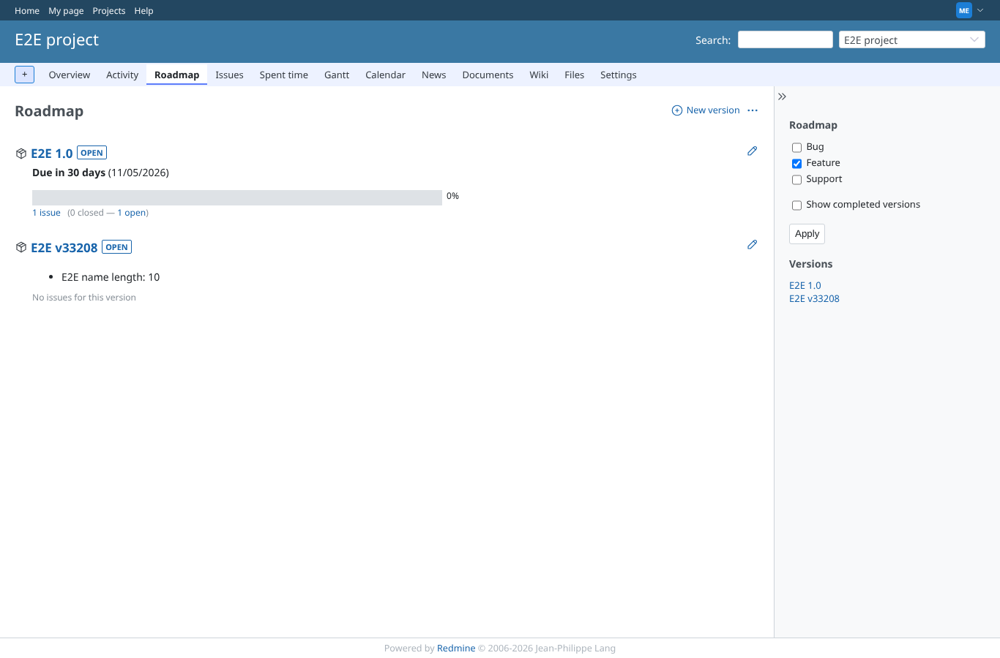
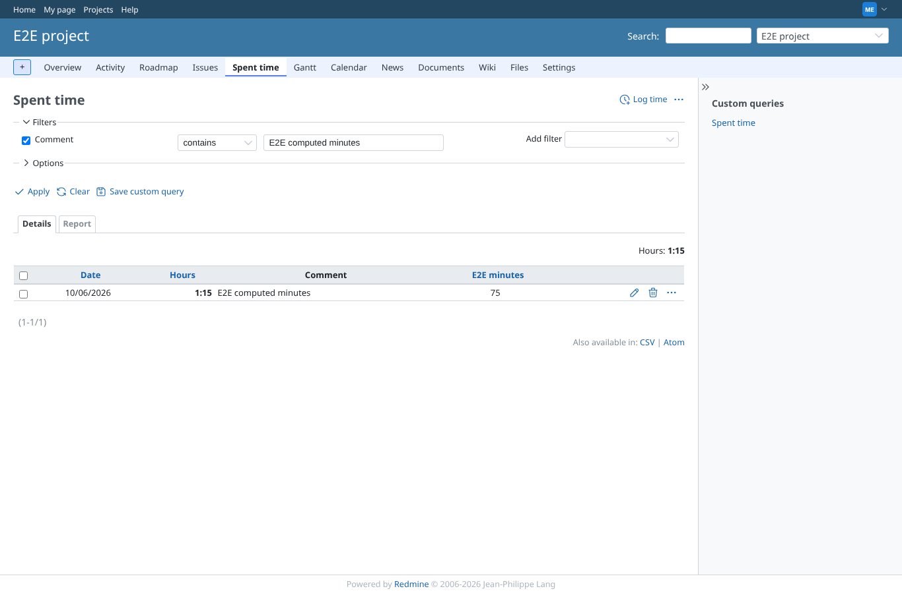
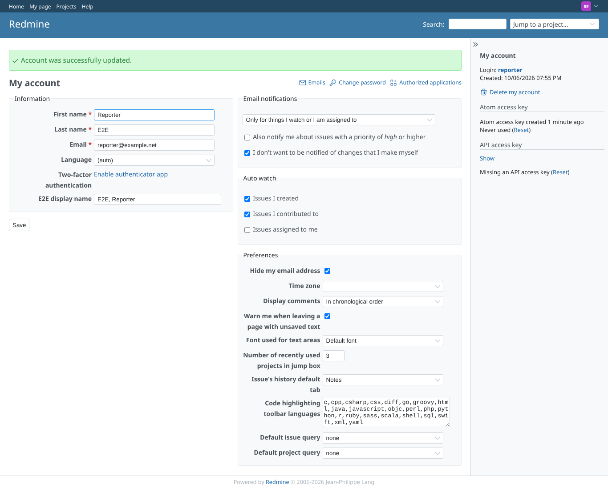
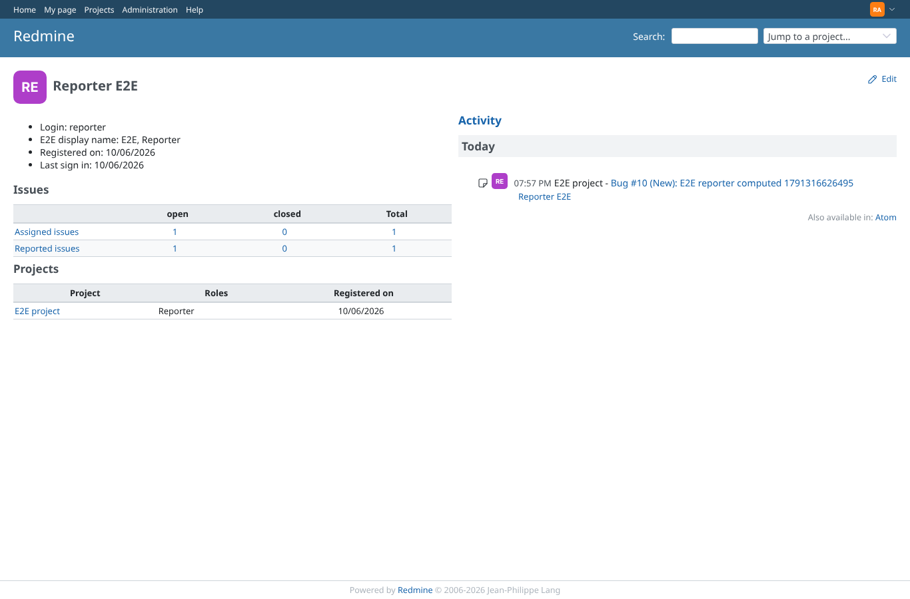
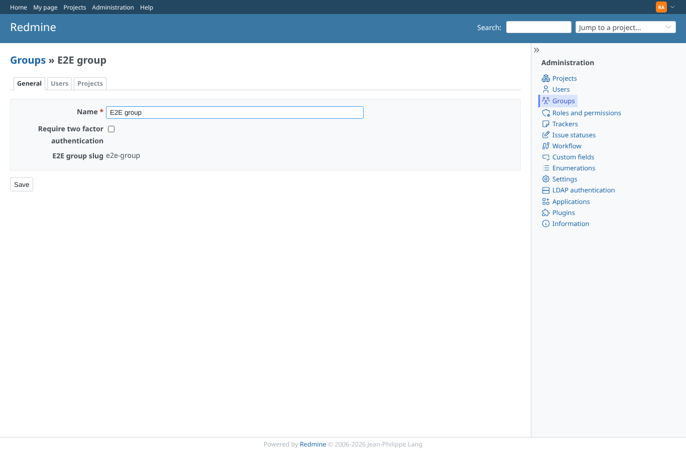
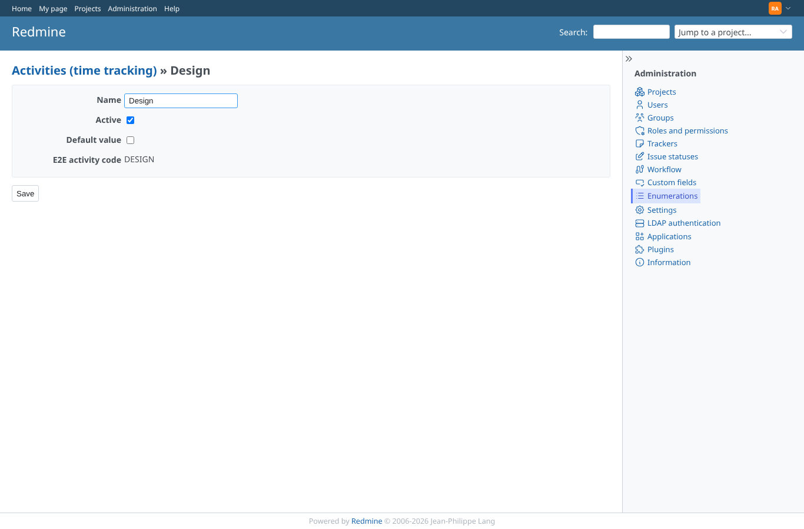

# other_models

Run 2026-10-06T19:57:28.723Z against http://127.0.0.1:3000.

| screenshot | user | URL | shows |
|---|---|---|---|
|  | manager | `/projects/e2e-project` | Project saved by the manager: "E2E project code" = E2E project code: E2E-PROJECT-1 |
|  | manager | `/projects/e2e-project/roadmap` | Version "E2E v33208" created by the manager: "E2E name length" = 10 |
|  | manager | `/projects/e2e-project/time_entries?set_filter=1&f[]=comments&op[comments]=~&v[comments][]=E2E+computed+minutes&c[]=spent_on&c[]=hours&c[]=comments&c[]=cf_13&sort=id:desc` | Time entry of 1.25 h logged by the manager with 999 typed in "E2E minutes": the formula overrides it with 75 |
|  | reporter | `/my/account` | The reporter saves their own account; the computed user field is shown as an input (not read-only outside issues, as before) |
|  | admin | `/users/6` | User profile: "E2E display name" = "E2E, Reporter", computed when the reporter saved the account |
|  | admin | `/groups/8/edit` | Group saved by the admin: "E2E group slug" = e2e-group |
|  | admin | `/enumerations/8/edit` | Time entry activity "Design" saved by the admin: "E2E activity code" = DESIGN |
