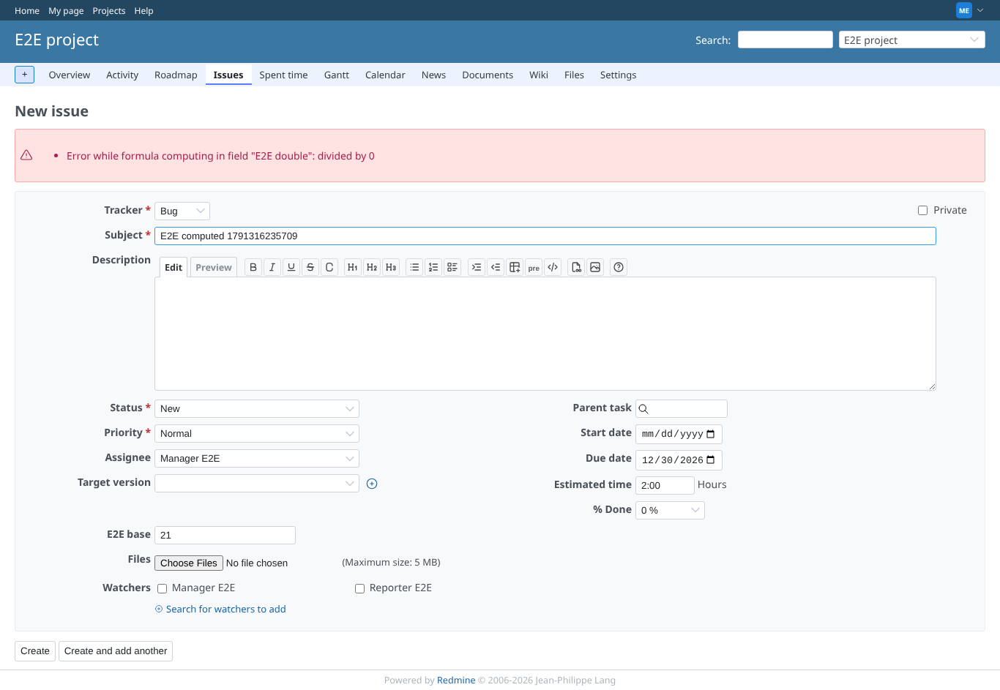

# Redmine 7 with the unfixed plugin (ba91e40, what GEOxyz runs today)

Run 2026-10-06 against 7.0-stable-GEOxyz, production mode, PostgreSQL, to show the
bug fixed in bdbf13f. Scenario test/e2e/formula_validation.mjs: 7 problems.

| screenshot | shows |
|---|---|
|  | `1 / 0` saved: "Successful creation", the field "E2E bad divided-by-zero" is listed |
|  | a syntax error is saved as well |
|  | `start_date.to_s(:db)` (gone in Rails 7) is saved |
|  | `cfs[999999]` is saved |
|  | "E2E double" now holds `1 / 0` |
|  | consequence: every issue save is refused with "Error while formula computing in field "E2E double": divided by 0" (the scenario stops here) |

With the branch (docs/e2e/formula_validation.md) all of these are refused with the reason.
