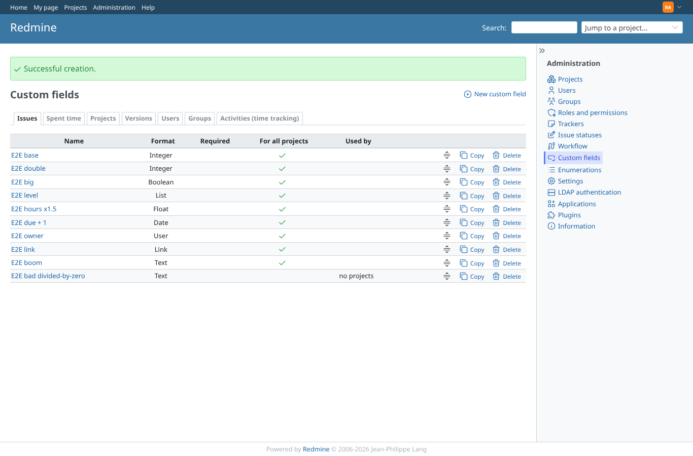
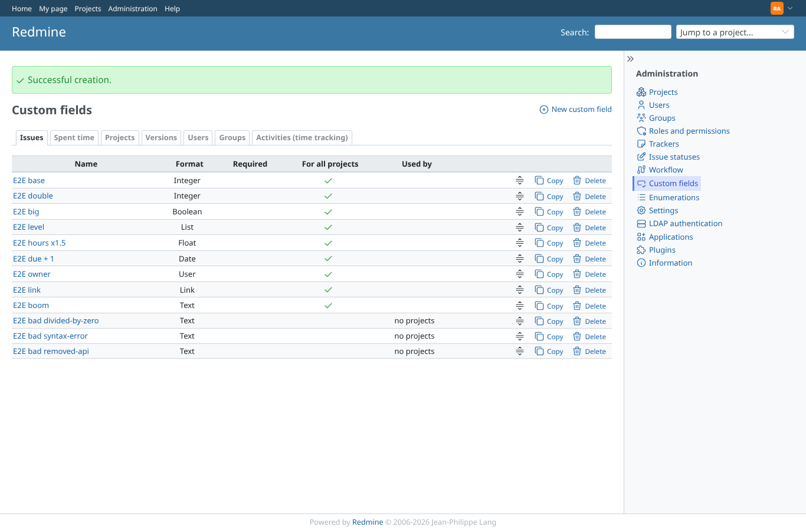
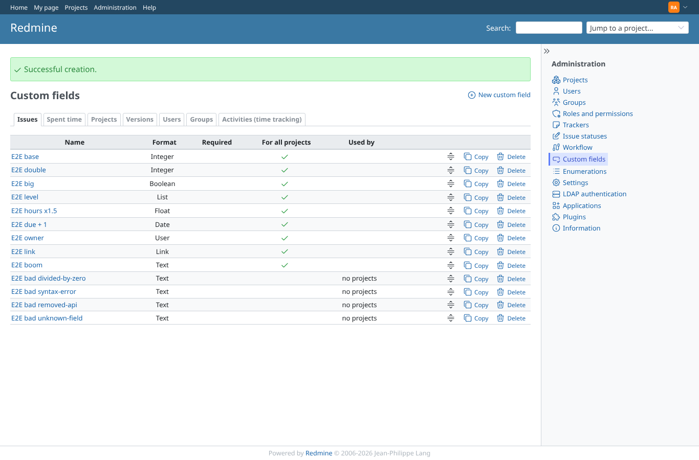
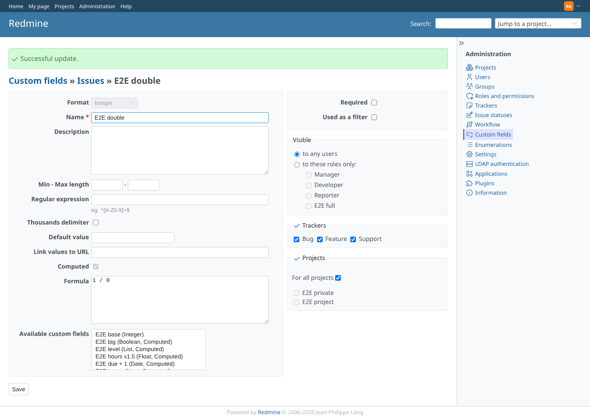
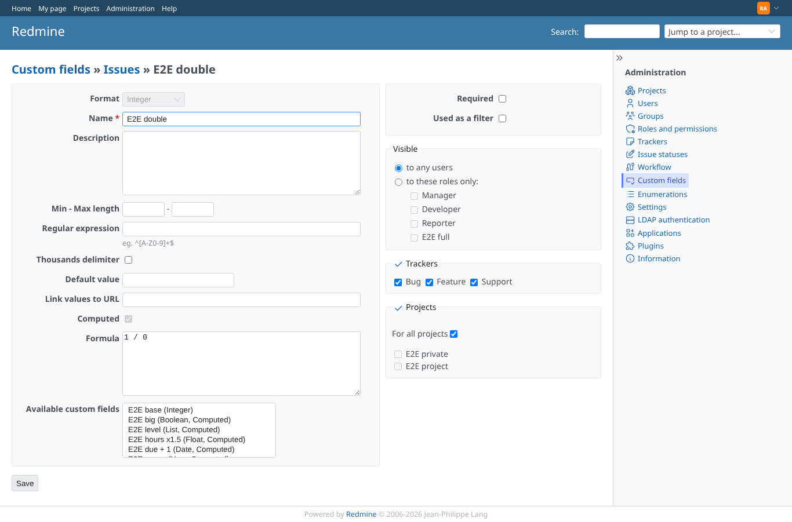

# formula_validation

Run 2026-10-06T19:50:28.778Z against http://127.0.0.1:3000.

| screenshot | user | URL | shows |
|---|---|---|---|
|  | admin | `/custom_fields?tab=IssueCustomField` | Create with formula "1 / 0" is refused:  |
|  | admin | `/custom_fields?tab=IssueCustomField` | Create with formula "cfs[1] +" is refused:  |
|  | admin | `/custom_fields?tab=IssueCustomField` | Create with formula "start_date.to_s(:db)" is refused:  |
|  | admin | `/custom_fields?tab=IssueCustomField` | Create with formula "cfs[999999] * 2" is refused:  |
|  | admin | `/custom_fields/2/edit` | Changing the formula of "E2E double" to 1 / 0 is refused with the reason |
|  | admin | `/custom_fields/2/edit` | The stored formula is unchanged: (cfs[1] || 0) * 2 |

## Problems

- divided-by-zero: "1 / 0" not refused with the reason, got ""
- syntax-error: "cfs[1] +" not refused with the reason, got ""
- removed-api: "start_date.to_s(:db)" not refused with the reason, got ""
- unknown-field: "cfs[999999] * 2" not refused with the reason, got ""
- an invalid computed field was created
- edit to 1 / 0 not refused
- the invalid formula was stored
