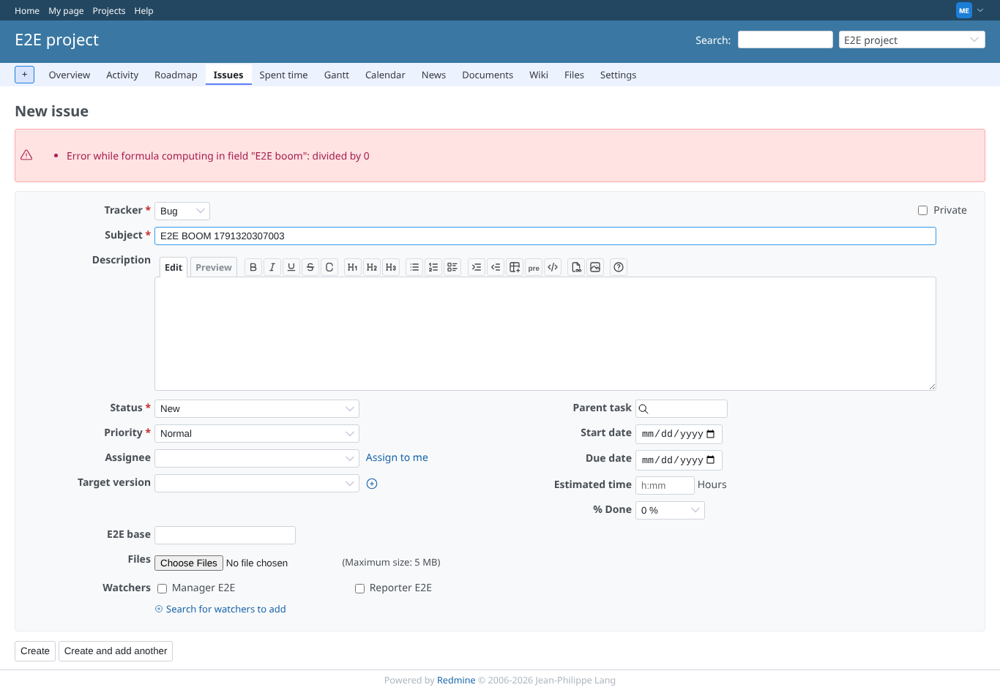
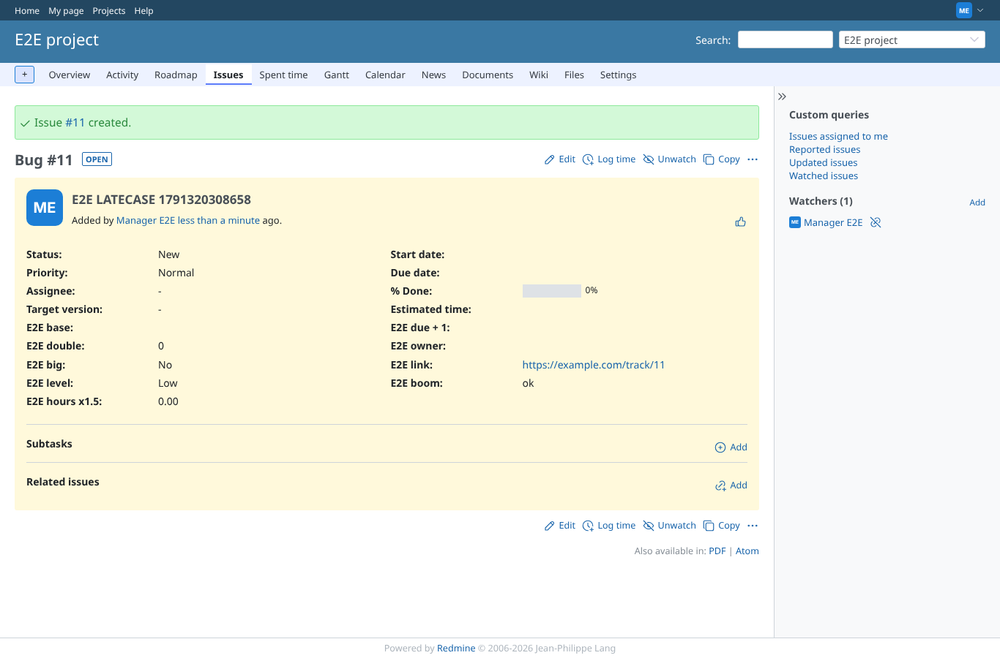
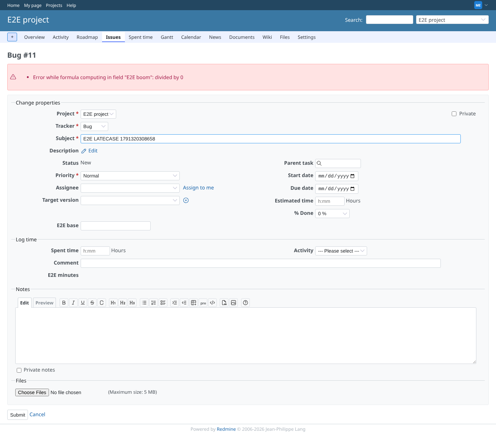
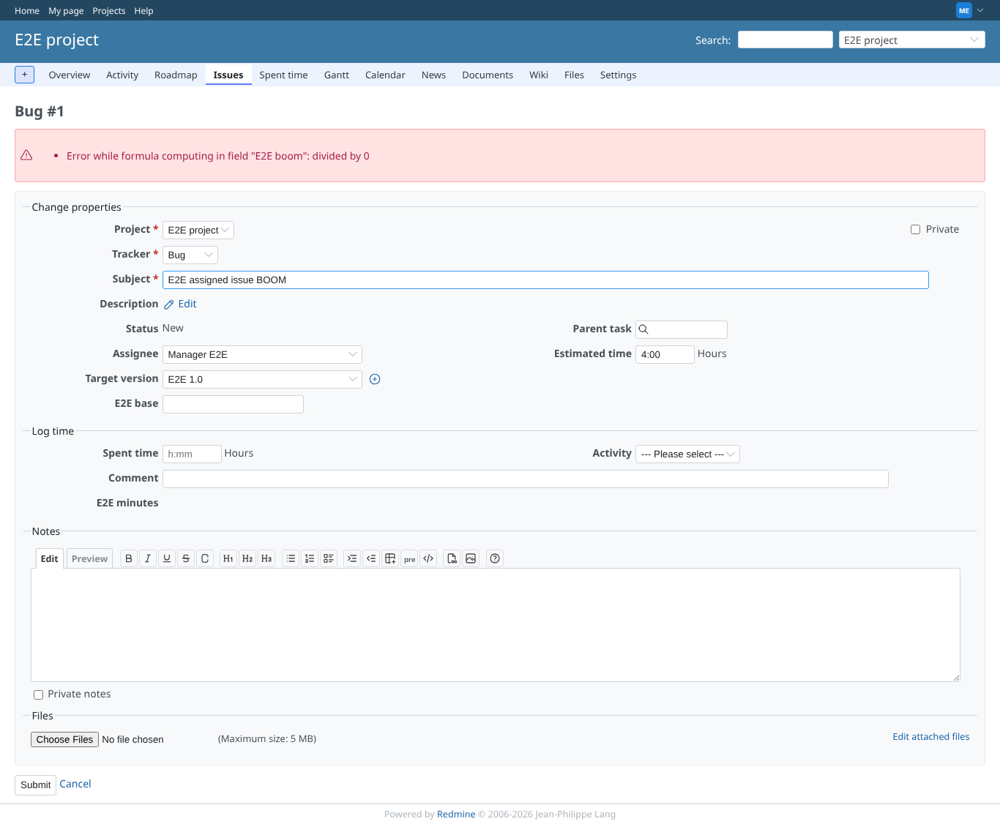
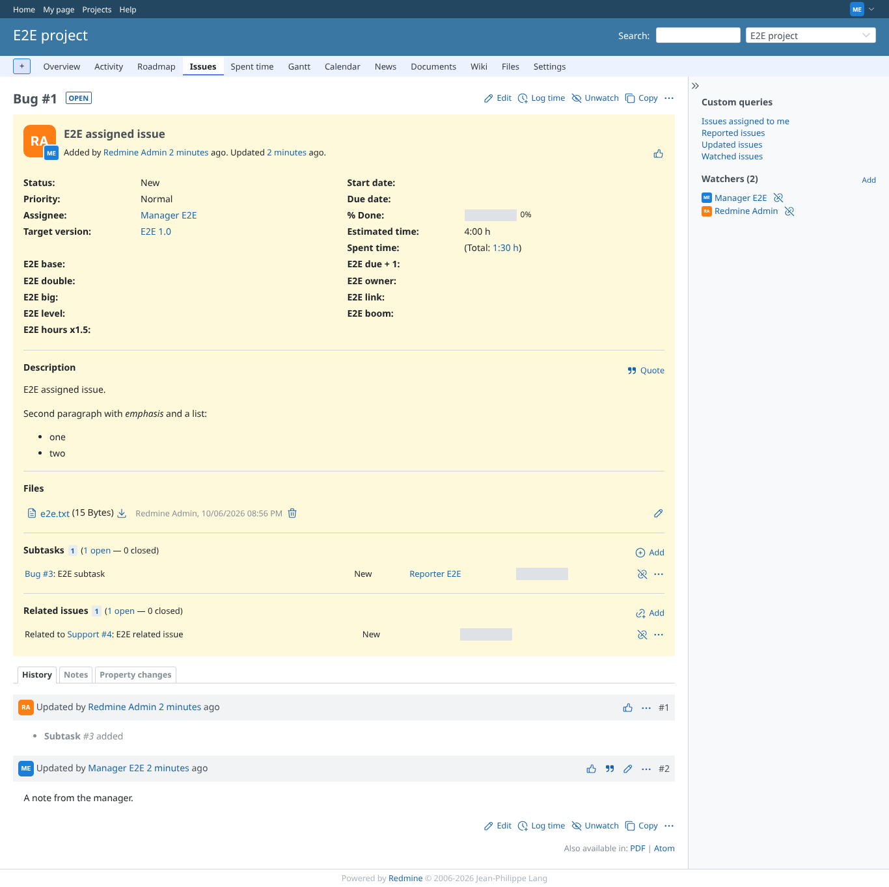
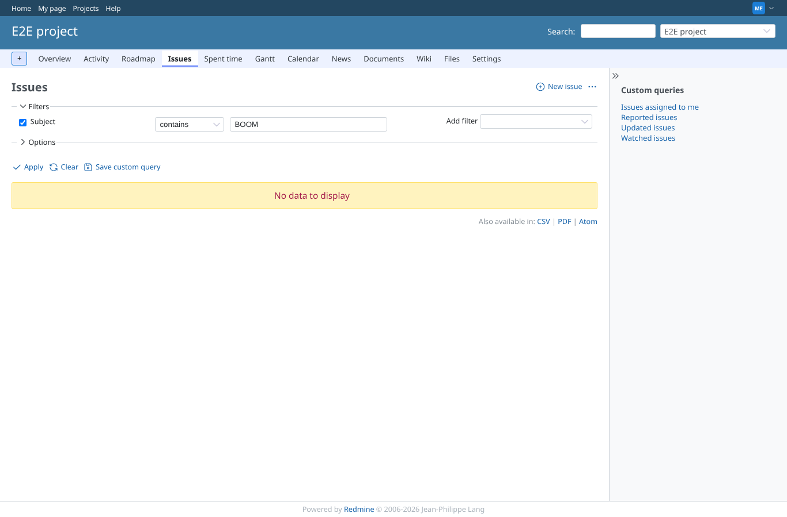

# runtime_error

Run 2026-10-06T20:58:35.533Z against http://127.0.0.1:3000.

| screenshot | user | URL | shows |
|---|---|---|---|
|  | manager | `/projects/e2e-project/issues` | Creating an issue whose subject makes "E2E boom" raise is refused: Error while formula computing in field "E2E boom": divided by 0 |
|  | manager | `/issues/11` | A formula that fails only once the id exists (subject LATECASE): created with the value from before the insert ("ok"), as on 5.1 |
|  | manager | `/issues/11` | The next save of that issue is refused with the formula error |
|  | manager | `/issues/1` | Editing an issue into the failing case is refused the same way |
|  | manager | `/issues/1` | The issue keeps its old subject |
|  | manager | `/projects/e2e-project/issues?set_filter=1&f[]=subject&op[subject]=~&v[subject][]=BOOM` | No issue with BOOM exists; the API answered HTTP 422 with the same error |
